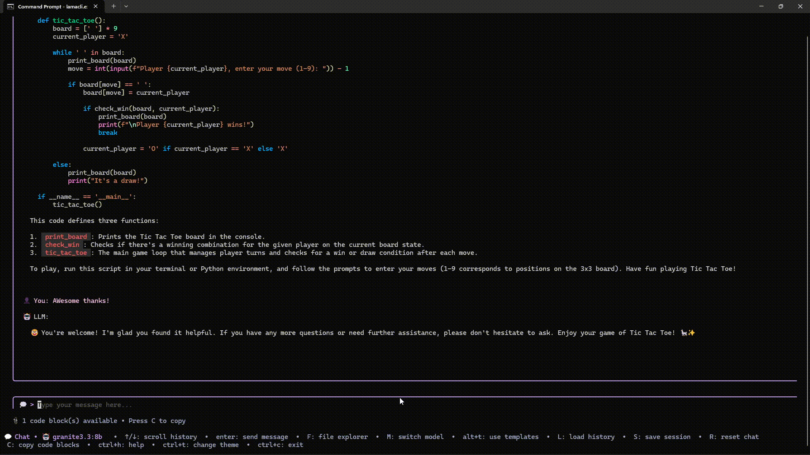
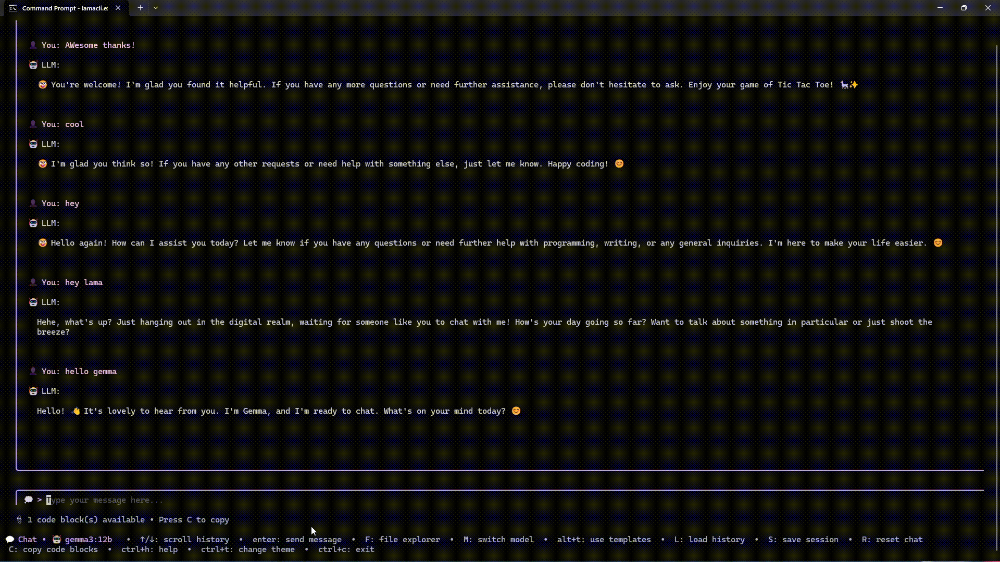

# LamaCLI 🦙✨ 

  

## 🚀 Your Local LLM Assistant, Right in Your Terminal!

LamaCLI is a powerful and intuitive command-line interface (CLI) tool that brings the magic of Large Language Models (LLMs) directly to your terminal, powered by [Ollama](https://ollama.ai/). 

<p align="center">
    
</p>

Engage with your AI assistant in both **interactive mode** and **command-line mode** — perfect for quick queries or extended conversations, all without leaving your terminal.

---

**Table of Contents**

- [LamaCLI 🦙✨ ](#lamacli--)
  - [🚀 Your Local LLM Assistant, Right in Your Terminal!](#-your-local-llm-assistant-right-in-your-terminal)
  - [✨ Features](#-features)
    - [🎯 Dual Operation Modes](#-dual-operation-modes)
    - [💬 Interactive Chat Features](#-interactive-chat-features)
    - [🗂️ File Management](#️-file-management)
    - [🤖 Model Management](#-model-management)
  - [⚡️ Get Started](#️-get-started)
    - [Prerequisites](#prerequisites)
    - [Installation](#installation)
      - [📦 Via npm (Recommended)](#-via-npm-recommended)
      - [🛠️ Via Go](#️-via-go)
      - [📥 Download Binary](#-download-binary)
    - [Usage](#usage)
    - [Key Bindings](#key-bindings)
  - [📺 Demo Videos](#-demo-videos)
  - [🖥️ CLI Mode Examples](#️-cli-mode-examples)
    - [Examples in CLI Mode:](#examples-in-cli-mode)
    - [Get Command Suggestions](#get-command-suggestions)
    - [Explain Commands](#explain-commands)
    - [Other Commands](#other-commands)
  - [🤝 Contributing](#-contributing)
  - [📄 License](#-license)
  - [❤️ Support LamaCLI](#️-support-lamacli)
  - [🙏 Credits](#-credits)

---

## ✨ Features

### 🎯 Dual Operation Modes
*   **Interactive Mode:** Full-featured TUI with real-time chat, file browsing, and model switching
*   **CLI Mode:** Quick one-shot commands for ask, suggest, and explain operations

### 💬 Interactive Chat Features
*   **Real-time Streaming:** Beautiful chat experience with live response streaming
*   **Markdown Support:** Fully rendered markdown with syntax-highlighted code blocks
*   **Chat Templates:** Predefined templates for common tasks (code review, documentation, debugging)
*   **Chat History:** Persistent session storage with load/save functionality
*   **Auto-save Sessions:** Conversations automatically saved after each interaction
*   **Code Block Management:** Extract, navigate, and copy code snippets with ease
*   **File Context Integration:** Inject file content into prompts using `@` command

### 🗂️ File Management
*   **Built-in File Explorer:** Browse project files with keyboard navigation
*   **File Viewer:** Preview file contents within the application
*   **Context-aware Operations:** Include directory contents in your queries
*   **Pattern Matching:** Filter files by patterns (e.g., `*.md`, `*.go`)

### 🤖 Model Management
*   **Multiple Model Support:** Switch between any Ollama models seamlessly
*   **Model Override:** Specify different models for different commands
*   **Default Model Detection:** Automatically uses your first available model
*   **Model Information:** View all available models and their status


## ⚡️ Get Started

### Prerequisites

Before you begin, ensure you have [Ollama](https://ollama.com/download) installed and running on your system. You can install Ollama using one of the following methods:

**macOS**
- Download the app from [Ollama's website](https://ollama.com/download).
- Or install via Homebrew:
    ```bash
    brew install ollama
    ```

**Windows**
- Download the installer from [Ollama's website](https://ollama.com/download).

**Linux**
- Run the official installation script:
    ```bash
    curl -fsSL https://ollama.com/install.sh | sh
    ```

After installation, make sure Ollama is running, then pull at least one model (e.g., `ollama pull llama3.2:3b`).

```bash
ollama pull llama3.2:3b
```

### Installation

LamaCLI is built with Go and available through multiple installation methods:

#### 📦 Via npm (Recommended)

```bash
# Install globally
npm install -g lamacli

# Or run without installing
npx lamacli
```

#### 🛠️ Via Go

```bash
go install github.com/hariharen9/lamacli@latest
```

#### 📥 Download Binary

Download the latest binary for your platform from the [releases page](https://github.com/hariharen9/lamacli/releases/latest).

### Usage

Simply run LamaCLI from your terminal:

```bash
lamacli
```

### Key Bindings

| Key       | Description                                                               |
| :-------- | :------------------------------------------------------------------------ |
| `Enter`   | Send message (in chat), Open file/folder (in file explorer)               |
| `↑`/`↓`   | Scroll history (in chat), Navigate items (in file tree/model select)      |
| `@`       | Trigger file context selection (in chat input)                            |
| `F`       | Open File Explorer                                                        |
| `M`       | Switch AI Model                                                           |
| `R`       | Reset/Clear Chat History                                                  |
| `C`       | Copy Code Blocks (when available in chat)                                 |
| `H`       | Show detailed Help screen                                                 |
| `Backspace` | Go to parent folder (in file explorer), Back to explorer (in file viewer) |
| `Esc`     | Return to chat from any view (file explorer, model select, help)          |
| `Ctrl+C`  | Exit application (requires two presses for confirmation)                  |
| `L`       | Load Chat History (browse and restore previous sessions)                  |
| `S`       | Save current session manually                                              |
| `Alt+T`   | Cycle through chat templates (code review, documentation, debugging)      |
| `Ctrl+T`  | Cycle through themes                                                       |

## 📺 Demo Videos

<table width="100%">
  <tr>
    <td width="50%" align="center">
      <b>Chatting with LLM</b>
      <br>
      
    </td>
    <td width="50%" align="center">
      <b>File History & Code Copy</b>
      <br>
      
    </td>
  </tr>
  <tr>
    <td width="50%" align="center">
      <b>Model Switching</b>
      <br>
      
    </td>
    <td width="50%" align="center">
      <b>Themes & Help</b>
      <br>
      
    </td>
  </tr>
</table>

## 🖥️ CLI Mode Examples

While the interactive mode is the main feature, LamaCLI also supports quick CLI commands for rapid queries:

### Examples in CLI Mode:
```bash
# Basic question
lamacli ask "How do I list files in Linux?"

# With model override
lamacli a --model=qwen2.5-coder:1.5b "Explain async/await in JavaScript"

# With project context
lamacli ask --context=. --include="*.md" "Summarize this project"
```

### Get Command Suggestions
```bash
# Get command suggestions
lamacli suggest "find large files over 100MB"

# With specific model
lamacli s --model=llama3.2:1b "git workflow for teams"
```

### Explain Commands
```bash
# Explain a command
lamacli explain "find . -name '*.go' -exec grep -l 'func main' {} \;"

# With model override
lamacli e --model=qwen2.5-coder "docker compose up -d"
```

### Other Commands
```bash
# Show available models
lamacli models

# Show version
lamacli version

# Show help
lamacli help
```

**Note:** All CLI commands support the `--model`, `--context`, `--include` and `--theme` flags for customization.

## 🤝 Contributing

We welcome contributions! If you have ideas for new features, bug fixes, or improvements, please feel free to open an issue or submit a pull request.

Please ensure your code adheres to the existing style and conventions.

## 📄 License

This project is licensed under the MIT License - see the [LICENSE](LICENSE.md) file for details.

## ❤️ Support LamaCLI

LamaCLI is an open-source project. Your support helps keep this project alive and thriving!
<p align="center">
    <a href="https://www.buymeacoffee.com/hariharen">
        
    </a>
    <a href="https://paypal.me/hariharen9">
        
    </a>
</p>

## 🙏 Credits

Built with [Bubble Tea](https://github.com/charmbracelet/bubbletea), [Lipgloss](https://github.com/charmbracelet/lipgloss), [Glamour](https://github.com/charmbracelet/glamour), [Huh](https://github.com/charmbracelet/huh), and powered by [Ollama](https://ollama.ai/).

Special thanks to [TLM](https://github.com/yusufcanb/tlm) for inspiration on the CLI command structure for ask, suggest, and explain operations.

<center>
<h3>Made with 💘 for all the terminal enthusiasts 🧑‍💻.</h3>
</center>

<p align="center">
  
</p>
